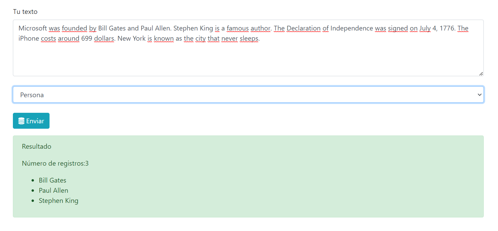
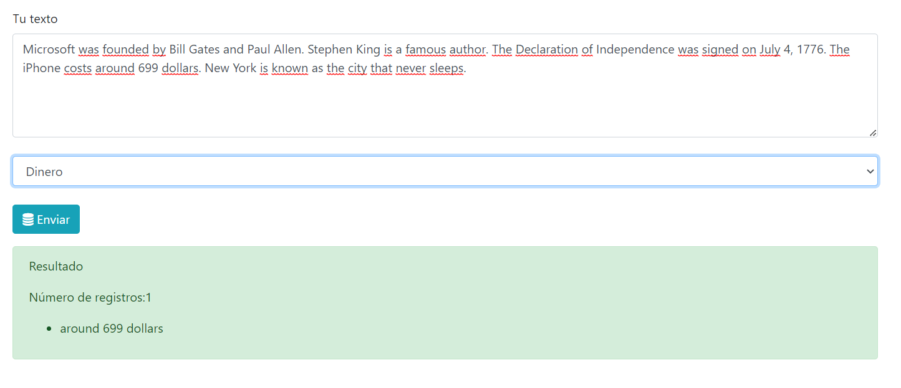
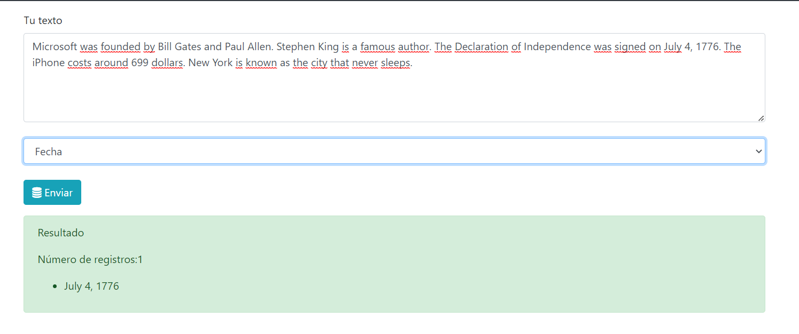
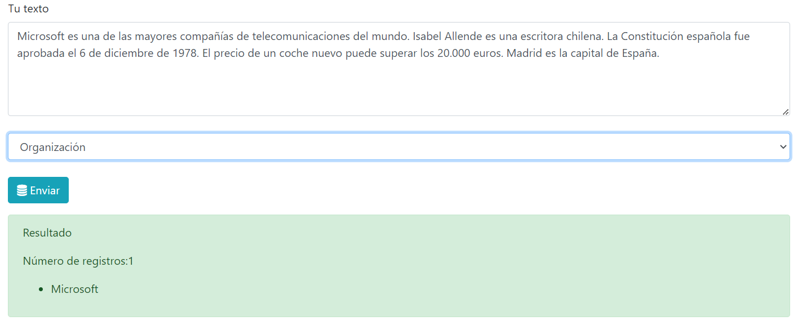
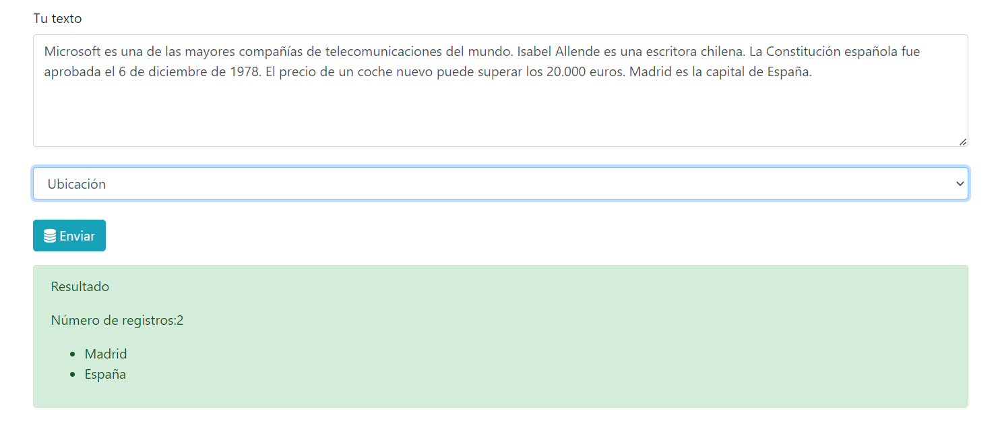

# Named Entity Extractor

Este proyecto es un extractor de entidades nombradas, utilizando el marco de trabajo Flask y la biblioteca de procesamiento de lenguaje natural Spacy.

## Resultados del Código

A continuación se presentan algunos resultados de la ejecución del código.

### En inglés

A continuación se muestran los resultados de la ejecución del código con textos en inglés.

### En español

A continuación se muestran los resultados de la ejecución del código con textos en español.

